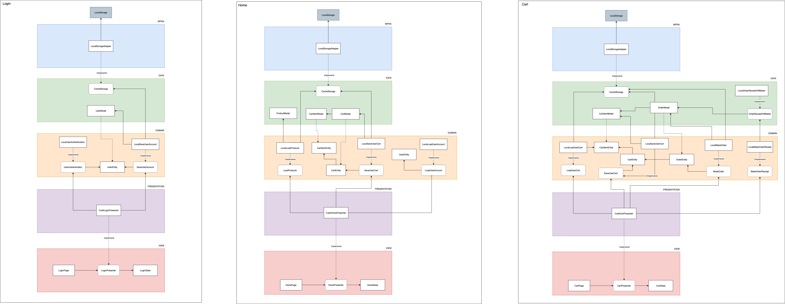

# grocery_store_app

App estilo e-commerce para compra de frutas. Principais informações:  
- Desenvolvido com Flutter 2.5.3
- Dados de usuário e produtos totalmente mocados
- Dados de autenticação, carrinho e compras ficam salvos em storage local
- Gerência de estados com Cubit
- Desenvolvido em sua maioria com TDD
    - Na Splash e User Account não houve tempo hábil
- Controle de navegação com AutoRoute
- Injeção de dependências com GetIt.
- Testes com Mockito e Faker


### Protótipo

Busquei algumas referências no Behance e [criei um protótipo no Figma](https://www.figma.com/file/qPIkrDk4svlQK7Rn6rPveB/App?node-id=0%3A1) (um pouco amador, mas tá valendo) para ter uma base no desenvolvimento.


### Arquitetura

Projeto desenvolvido seguindo a Clean Architecture.
Especificação macro de algums dos principais módulos:  



### Cobertura de testes

Para rodar os testes e gerar o relatório de cobertura, executar o script `run_coverage.sh`

```bash
Overall coverage rate:
  lines......: 74.5% (1027 of 1378 lines)
```


